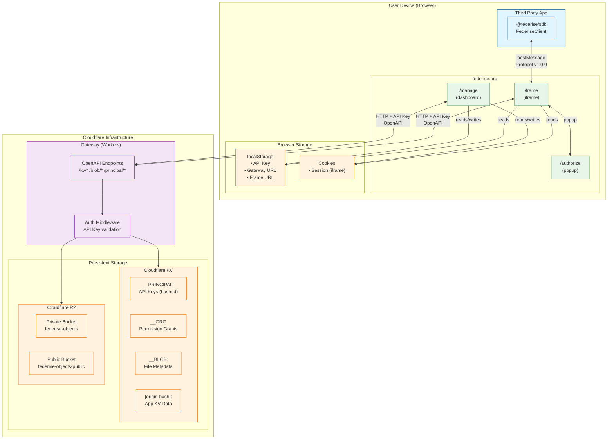
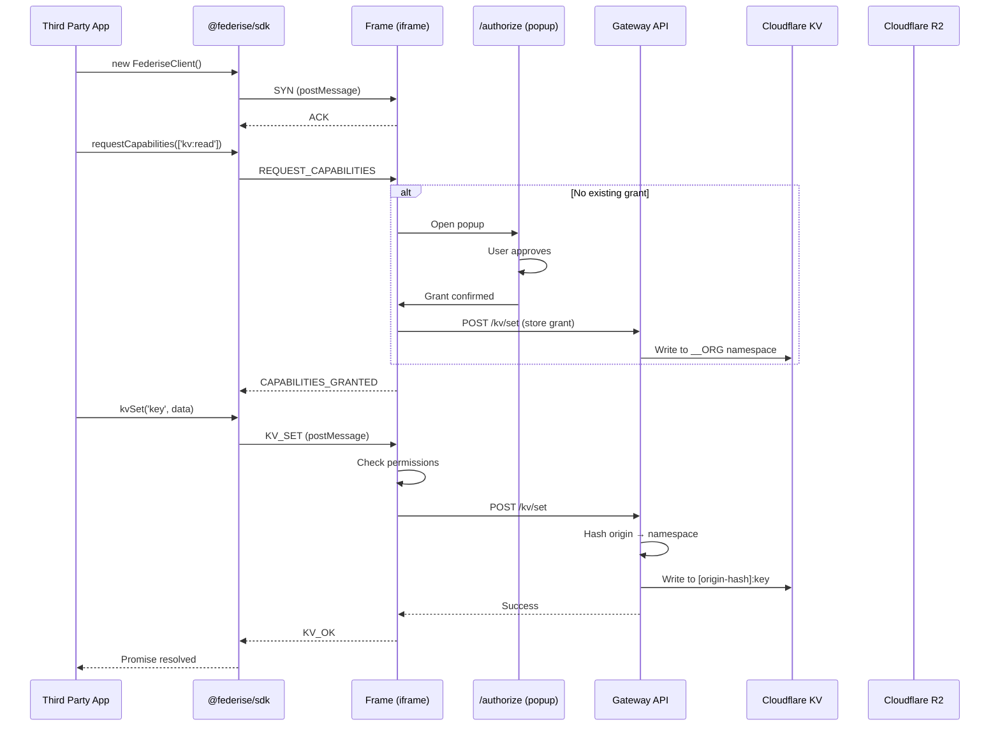
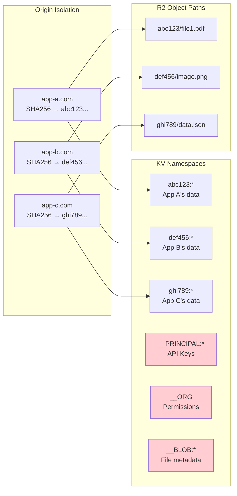

# Federise

Federise is a federated identity and data storage system that enables secure, cross-origin data sharing. Users own and control their data through a standardized API, while third-party applications can request scoped access via an iframe-based architecture.

## Core Principles

1. **User Ownership** - Users own their data and control access to it
2. **Federated Architecture** - Multiple implementations can provide the same API
3. **Origin Isolation** - Each application gets its own isolated data namespace
4. **Scoped Access** - Applications request specific capabilities, users grant/deny them
5. **Standardized Interface** - All Core implementations expose the same OpenAPI HTTP interface

* Storage - Can be relational, document, or blob storage
* Compute - Heavy compute like LLM (privlidged access to APIs)
* Events - Notifications, Daemons, Chron Jobs, Etc.
* Actions - The ability to execute actions that a client cannot (unprivlidged fetch)
* Access - The ability to share these capabilities in a configurable manner. eg. sharing a file stored
          - in a S3 bucket

## Components

### The Core (Gateway)

The Core is the backend API that provides authenticated, scoped access to various capabilities. It comes in different forms and implementations, all providing the same OpenAPI HTTP Interface.

#### Capabilities

* **Storage** - Key-value storage for structured data, blob storage for files
  * KV: Get, set, delete, list keys with prefix filtering, bulk operations
  * Blob: Upload (direct or presigned), download, delete, list files
* **Compute** - Heavy compute like LLM inference (planned)
* **Events** - Notifications, daemons, cron jobs (planned)
* **Actions** - Server-side operations that clients cannot perform (e.g., unprivileged fetch)
* **Access** - Share capabilities in a configurable manner (e.g., sharing a file from storage)

#### Implementation Examples

- **Cloudflare Gateway** (current implementation) - A gateway on Cloudflare Workers, using KV for metadata and R2 for blob storage
- **Self-hosted Instance** - A single-tenant server running on user-controlled hardware
- **Multi-tenant Service** - A dedicated service providing capabilities on behalf of users

All implementations expose the same standardized API. The key is that they are "owned" by the user.

#### Current Implementation Details

The `apps/gateway` is a Cloudflare Workers API built with:
- **Hono** - Lightweight web framework
- **Chanfana** - OpenAPI documentation generation
- **Zod** - Runtime validation schemas
- **Cloudflare KV** - Key-value storage (namespaced by origin SHA-256 hash)
- **Cloudflare R2** - S3-compatible blob storage

**Endpoints:**
| Category | Endpoint | Description |
|----------|----------|-------------|
| Principal | `POST /principal/list` | List all API principals |
| Principal | `POST /principal/create` | Create new API key |
| Principal | `POST /principal/delete` | Delete a principal |
| KV | `POST /kv/get` | Get a value |
| KV | `POST /kv/set` | Set a value |
| KV | `POST /kv/keys` | List keys with prefix |
| KV | `POST /kv/bulk/get` | Get multiple keys |
| KV | `POST /kv/bulk/set` | Set multiple key-value pairs |
| Blob | `POST /blob/upload` | Upload file (gateway fallback) |
| Blob | `POST /blob/presign-upload` | Get presigned URL for direct R2 upload |
| Blob | `POST /blob/get` | Get download URL |
| Blob | `POST /blob/delete` | Delete a file |
| Blob | `POST /blob/list` | List files in namespace |
| Admin | `POST /admin/check` | Health check |
| Admin | `POST /admin/setup` | Initial setup (requires bootstrap key) |

**Authentication:**
- Header-based: `Authorization: ApiKey <hash>`
- API keys are SHA-256 hashed before storage
- Bootstrap key for initial setup

### Website `federise.org`

Trusted, not-for-profit entity. Fundamental to make Federise work as broadly as possible without extensions.

The `apps/org` is an Astro + Svelte application deployed to Cloudflare Pages.

#### Start (`/start`)
Get a new user started with Federise. Guides users through:
- Understanding what Federise provides
- Setting up their first gateway
- Connecting their gateway to federise.org

#### Management (`/manage`)
Manage and configure existing Federise instance:
- **Overview** (`/manage/overview`) - Gateway status and health
- **Connection** (`/manage/connection`) - Gateway connection setup and configuration
- **Settings** (`/manage/settings`) - App-level settings
- **Principals** (`/manage/principals`) - API key management
- **Permissions** (`/manage/permissions`) - Origin-based permission grants
- **Data** (`/manage/data`) - KV data browser and management
- **Recovery** (`/manage/recovery`) - Account recovery options

#### Frame (`/frame`)
Acts as a trusted proxy to the Core, intended to be embedded as an iframe in third-party apps.

**Responsibilities:**
- Holds secrets (API key) necessary to connect to the user's configured Core
- Enforces permissions per-origin
- Handles authorization flows and scoped access
- Uses Storage Access API for cross-origin cookie access in iframe context

**How it works:**
1. Host app embeds the Frame in an iframe
2. Frame receives requests via postMessage protocol
3. Frame checks if the requesting origin has required capabilities
4. If not, Frame triggers authorization popup (`/authorize`)
5. If granted, Frame forwards request to Gateway
6. Gateway isolates data by origin (SHA-256 namespace)
7. Frame returns response to host app

#### Authorize (`/authorize`)
Popup window shown when an application requests capabilities. Displays:
- Which app is requesting access
- What capabilities are being requested
- Grant/deny controls

### Third Party Apps

Applications that are untrusted and not associated with Federise. These are the consumers of Federise capabilities. Designed for apps with minimal backend (static sites, SPAs, GitHub Pages).

**Integration pattern:**
1. Include the `@federise/sdk` package
2. Create a `FederiseClient` instance
3. Request capabilities (user sees authorization popup)
4. Use granted capabilities (KV storage, blob storage, etc.)

### SDK (`packages/sdk`)

NPM package (`@federise/sdk`) providing convenience for developers integrating with Federise.

**Core API:**
```typescript
import { FederiseClient } from '@federise/sdk';

const client = new FederiseClient({
  frameUrl: 'https://federise.org/frame',
  timeout: 30000
});

// Request capabilities
const result = await client.requestCapabilities(['kv:read', 'kv:write']);

// Use capabilities
await client.kvSet('my-key', { data: 'value' });
const value = await client.kvGet('my-key');
```

**Capabilities:**
| Capability | Description |
|------------|-------------|
| `kv:read` | Read from key-value storage |
| `kv:write` | Write to key-value storage |
| `kv:delete` | Delete from key-value storage |
| `blob:read` | Read/download files |
| `blob:write` | Upload files |
| `notifications` | Send notifications (planned) |

**Protocol (v1.0.0):**
Communication between SDK and Frame uses postMessage with request/response correlation.

Request types: `SYN`, `REQUEST_CAPABILITIES`, `KV_GET`, `KV_SET`, `KV_DELETE`, `KV_KEYS`, `BLOB_UPLOAD`, `BLOB_GET`, `BLOB_DELETE`, `BLOB_LIST`

Response types: `ACK`, `AUTH_REQUIRED`, `CAPABILITIES_GRANTED`, `PERMISSION_DENIED`, `KV_RESULT`, `KV_OK`, `BLOB_UPLOADED`, `BLOB_DOWNLOAD_URL`, `ERROR`

**Error Handling:**
- `FederiseError` - Base error class
- `PermissionDeniedError` - Insufficient capabilities
- `TimeoutError` - Request timeout
- `ConnectionError` - Connection/iframe issues

### Demo App (`apps/demo`)

Reference implementation showing how host applications integrate with Federise SDK.

Built with Svelte + Vite, demonstrates:
- Connecting to Federise frame
- Requesting capability grants
- Performing KV operations
- File upload/download/management

### User Devices

Personal devices where users interact with Federise:
- Browsers running third-party apps
- Devices where self-hosted instances may run
- Mobile devices (future)

## Architecture Diagram



## Component Interactions



## Storage Architecture



## Data Flow (Text)

```
┌─────────────────────────────────────────────────────────────────┐
│                      Host Application                           │
│                    (uses @federise/sdk)                         │
└─────────────────────────┬───────────────────────────────────────┘
                          │ postMessage
                          ▼
┌─────────────────────────────────────────────────────────────────┐
│                    Frame @ federise.org                         │
│              (embedded in iframe, manages auth)                 │
└─────────────────────────┬───────────────────────────────────────┘
                          │ HTTP + API Key
                          ▼
┌─────────────────────────────────────────────────────────────────┐
│                        Gateway                                  │
│              (Cloudflare Workers API)                           │
└─────────────────────────┬───────────────────────────────────────┘
                          │
          ┌───────────────┼───────────────┐
          ▼               ▼               ▼
     ┌─────────┐    ┌─────────┐    ┌─────────┐
     │   KV    │    │   R2    │    │  R2     │
     │(metadata)│   │(private)│    │(public) │
     └─────────┘    └─────────┘    └─────────┘
```

## Origin Isolation

Each application (identified by origin) gets its own isolated namespace:
- Origin is hashed with SHA-256
- KV keys are prefixed with origin hash
- Blob paths are prefixed with origin hash
- Prevents cross-origin data access

Special namespaces:
- `__PRINCIPAL:` - API key storage
- `__BLOB:` - Blob metadata
- `__ORG` - Permission grants

## Technology Stack

### Backend (Gateway)
- Runtime: Cloudflare Workers (V8 isolate)
- Framework: Hono
- Validation: Zod
- Storage: Cloudflare KV + R2

### Frontend (Org/Frame)
- Meta-framework: Astro
- UI: Svelte 5
- Deployment: Cloudflare Pages
- API Client: OpenAPI Fetch (generated from Gateway spec)

### SDK
- Language: TypeScript
- Communication: postMessage protocol
- Distribution: NPM

### Tooling
- Package Manager: pnpm (workspaces)
- Build: tsc, Wrangler, Vite
- API Generation: Chanfana + openapi-typescript

## Future Considerations

- Alternative Core implementations (AWS, GCP, self-hosted)
- Mobile SDK
- Compute capabilities (LLM, serverless functions)
- Event system (notifications, webhooks, cron)
- Actions (privileged server-side operations)
- Extended sharing mechanisms
